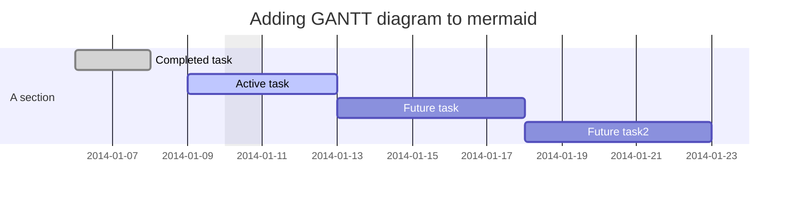

# Mindkey APIs

🏸 Illustrates the applicability of Mindkey APIs for industry specific functions and adaptations to standards.

# Integrations API

MindKey integrations API builds the connection between MindKey and the customer’s existing applications. This enables companies to automate tasks, keep data synchronized, and integrate their programs and databases with MindKey as desired.

# Recruiting API

The API is used to retrieve vacancies and data for application forms, and can also receive submitted applications from candidates. It can be used on the customer’s recruitment webpage to integrate with MindKey recruitment while affording a high degree of customizability.

# System API

The system API provides a secure and reliable framework for integrating Mindkey technology into various applications and platforms. It offers standardized protocols for data exchange, authentication, and privacy protection, ensuring the confidentiality and integrity of information.
